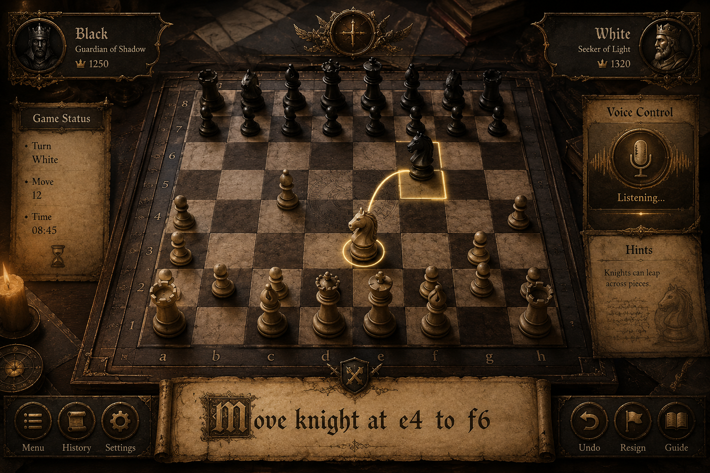

<div align="center">

# ⚔️ ചതുരംഗം — Chathurangam
### *Malayalam Voice-Controlled Hands-Free Accessible Chess*

[](LICENSE)
[](#)
[](#)
[](#)
[](#)
[](#)

<br/>



<br/><br/>

**ചതുരംഗം (Chathurangam)** is an accessible, voice-driven chess application crafted specifically for players with mobility impairments who cannot use a physical board, mouse, or keyboard. By speaking natural Malayalam or English commands, players can command pieces, learn tactics, play against an AI engine, and compete with friends—**100% hands-free**.

[✨ Live Features](#-key-features) • [🎙️ Voice Commands](#-voice-command-dictionary) • [🚀 Quick Start](#-quick-start) • [🧠 AI & Engine](#-chess-engine--coach) • [🎨 Aesthetics](#-medieval-design-system)

</div>

---

## 🌟 Mission & Purpose

Traditional chess requires fine motor skills to physically move pieces or drag them across a touch screen. For quadriplegic or paralyzed individuals who have intact speech and fluency in **Malayalam**, this web application creates a frictionless bridge:

1. **Zero Touch Required**: The application boots into listening mode with a spoken audio introduction, starts the clock automatically, and listens continuously.
2. **Native Malayalam Recognition**: Robust phonetic parsing covering natural Malayalam dialect patterns, sandhi grammar suffixes, and mixed Malayalam-English speech.
3. **Integrated Tactical Coach**: Real-time blunder alerts and hint recommendations to help players study and improve their chess mastery.

---

## ✨ Key Features

| Feature | Description |
| :--- | :--- |
| 🎙️ **100% Hands-Free Play** | Automatically starts listening on page load; screen wake-lock prevents display sleep during matches. |
| ⚡ **Zero-Latency Execution** | Fast-path interim speech execution executes valid moves in `<50ms` with subtle audio feedback and zero blocking delays. |
| 🔀 **Acoustic Disambiguation** | Smart chess-context resolver automatically distinguishes acoustically ambiguous sounds (e.g. **'B'** vs **'D'**, rank **'1'** variations). |
| 🤖 **Multi-Level AI Engine** | Minimax algorithm with Alpha-Beta pruning supporting **Beginner** (Easy), **Intermediate** (Medium), and **Expert** (Hard) bots. |
| 🎓 **Blunder & Tactical Coach** | Evaluates material swings and notifies players with visual alerts if a valuable piece is left undefended. |
| 📜 **Custom Voice Introduction** | Players or caregivers can write and save personalized spoken welcome messages via the built-in Settings panel. |
| 🏰 **Medieval Dark Gold HUD** | Responsive board with Cinzel medieval typography, piece trails, glowing legal move dots, and an always-visible voice HUD. |
| 🚫 **Explicit Fault Move Reporting** | Clearly distinguishes chess rule violations from speech recognition errors (e.g. `❌ തെറ്റായ നീക്കം: e2 → e5 സാധ്യമല്ല`). |

---

## 🎙️ Voice Command Dictionary

### 1. ♟️ Piece Moves & Coordinates

Players can speak moves in multiple natural formats:

| Format | Spoken Voice Example (Malayalam / English) | Board Action |
| :--- | :--- | :--- |
| **From ➔ To** | `"ഇ രണ്ട് ഇ നാല്"` / `"e2 e4"` | Moves pawn from **e2** to **e4** |
| **Piece ➔ Square** | `"കുതിര എഫ് മൂന്ന്"` / `"Knight f3"` | Moves Knight to **f3** |
| **Piece ➔ Target** | `"കാലാൾ ഡി നാല്"` / `"Pawn d4"` | Moves Pawn to **d4** |
| **Direct Square** | `"ഡി നാല്"` / `"d4"` | Moves Pawn to **d4** |
| **Step-by-Step** | `"കുതിര"` ➔ *"g1 highlights"* ➔ `"എഫ് 3"` | Stages Knight on **g1**, then moves to **f3** |

#### 🔤 Supported Phonetic Letter & Rank Dictionary
- **Files (Columns)**:
  - **A**: `"എ"`, `"ഏ"`, `"ആ"`, `"a"`, `"A"`, `"aye"`, `"എയ്"`
  - **B**: `"ബി"`, `"ബീ"`, `"b"`, `"B"`, `"bee"`, `"ബ"`
  - **C**: `"സി"`, `"സീ"`, `"c"`, `"C"`, `"see"`
  - **D**: `"ഡി"`, `"ഡീ"`, `"d"`, `"D"`, `"dee"`, `"ദി"`, `"ഡ"`
  - **E**: `"ഇ"`, `"ഈ"`, `"e"`, `"E"`, `"യി"`, `"ee"`
  - **F**: `"എഫ്"`, `"എഫ"`, `"f"`, `"F"`, `"ef"`
  - **G**: `"ജി"`, `"ജീ"`, `"g"`, `"G"`
  - **H**: `"എച്ച്"`, `"എച്ച"`, `"എയ്ച്ച്"`, `"h"`, `"H"`, `"ഹാ"`
- **Ranks (Rows)**:
  - **1**: `"ഒന്ന്"`, `"ഒന്നു"`, `"വൺ"`, `"1"`, `"one"`, `"on"`, `"first"`, `"൧"`
  - **2–8**: `"രണ്ട്"`, `"മൂന്ന്"`, `"നാല്"`, `"അഞ്ച്"`, `"ആറ്"`, `"ഏഴ്"`, `"എട്ട്"` / `"2"–"8"` / `"two"–"eight"`

---

### 2. 🧭 UI & Game Navigation Controls

| Spoken Voice Command | English Meaning | Triggered Action |
| :--- | :--- | :--- |
| **`"സഹായം"`** / `"Help"` | Help | Opens Voice Command Reference modal |
| **`"സെറ്റിംഗ്സ്"`** / `"Settings"` | Settings | Opens Settings & Custom Voice Intro |
| **`"ഹിസ്റ്ററി"`** / `"History"` | History | Opens Move List history |
| **`"ക്ലോസ്"`** / **`"ബാക്ക്"`** / `"Close"` | Close | Closes any open modal dialog |
| **`"വേണ്ട"`** / **`"ക്യാൻസൽ"`** | Cancel | Cancels active piece/square selection |
| **`"പുതിയ കളി"`** / `"New Game"` | New Game | Starts a new AI Bot match |
| **`"സുഹൃത്ത്"`** / `"Friend"` | Friend Game | Starts local 2-player pass-and-play match |
| **`"പിൻവലിക്കുക"`** / `"Undo"` | Undo | Reverts last move |
| **`"സൂചന"`** / `"Hint"` | Hint | Evaluates and highlights the best tactical move |
| **`"കീഴടങ്ങുക"`** / `"Resign"` | Resign | Resigns the match |
| **`"കാസ്‌ലിംഗ്"`** / `"Castle"` | Castle | Executes King or Queen side castling |
| **`"തിരിക്കുക"`** / `"Flip"` | Flip Board | Rotates the board orientation |
| **`"എളുപ്പം"` / `"ഇടത്തരം"` / `"കഠിനം"` | Difficulty | Sets AI Bot to Beginner, Medium, or Hard |
| **`"മൈക്ക് ഓഫ്"`** / **`"മൈക്ക് ഓൺ"`** | Mic Toggle | Mutes or unmutes speech recognition |

---

## 🧠 Chess Engine & Coach

The application includes an internal chess intelligence engine:
- **Minimax with Alpha-Beta Pruning**: Fast tree search that evaluates piece material balance and Piece-Square Tables (PST) without freezing the UI thread.
- **Dynamic Positional Evaluation**:
  - Center control incentives.
  - Piece mobility and outpost positioning.
  - King safety and castle protection heuristics.
- **Blunder Detection Engine**:
  - Compares position evaluation before and after the move.
  - Warns if high-value pieces (Queen, Rook, Bishop, Knight) are left hanging without adequate defense.

---

## 🎨 Medieval Design System

The visual design is inspired by ancient medieval strategy games:
- **Palette**: Deep Obsidian (`#0d0a06`), Antique Gold (`#d4af37`), Parchment Cream (`#fff5be`), and Crimson Accents (`#8b1e1e`).
- **Typography**: Google Fonts [`Cinzel`](https://fonts.google.com/specimen/Cinzel), [`MedievalSharp`](https://fonts.google.com/specimen/MedievalSharp), and [`Noto Sans Malayalam`](https://fonts.google.com/specimen/Noto+Sans+Malayalam).
- **Responsive Layout**: Fluid CSS Grid and Flexbox adapting smoothly from mobile phones and tablets to widescreen monitors.
- **Micro-Audio FX**: Custom Web Audio API synthesizer for move clicks, start chimes, and illegal move tones without blocking the microphone.

---

## 🚀 Quick Start

### 1. Requirements
- Any modern browser supporting the **Web Speech API** (Google Chrome or Chromium-based browsers recommended).
- Microphone access enabled.

### 2. Running Locally
Clone the repository and open `index.html` in your browser:

```bash
# Clone repository
git clone https://github.com/Christy-Roy-tech/---Malayalam-Voice-Enabled-Chess-.git

# Navigate to directory
cd ---Malayalam-Voice-Enabled-Chess-

# Serve locally (e.g. using Python or Node http-server)
python -m http.server 8000
```
Open `http://localhost:8000` in Google Chrome and allow microphone access when prompted.

---

## 📁 Repository Structure

```
├── index.html        # Semantic HTML5 layout, HUD, coordinate board & modals
├── styles.css        # Medieval dark gold theme, animations & responsive styles
├── app.js            # Voice recognition parser, chess AI engine, Web Audio FX & state
├── favicon.svg       # Glowing gold knight vector favicon with soundwave accent
├── Chess.png         # Project visual banner preview
└── README.md         # Comprehensive project documentation
```

---

## 🤝 Accessibility & Inclusivity

This project was built with ❤️ to empower physically challenged individuals through technology. If you have suggestions for additional language dialects, speech patterns, or accessibility enhancements, contributions and pull requests are warmly welcomed!

---

<div align="center">

Made with ⚔️ by **[Christy Roy](https://github.com/Christy-Roy-tech)**

</div>
